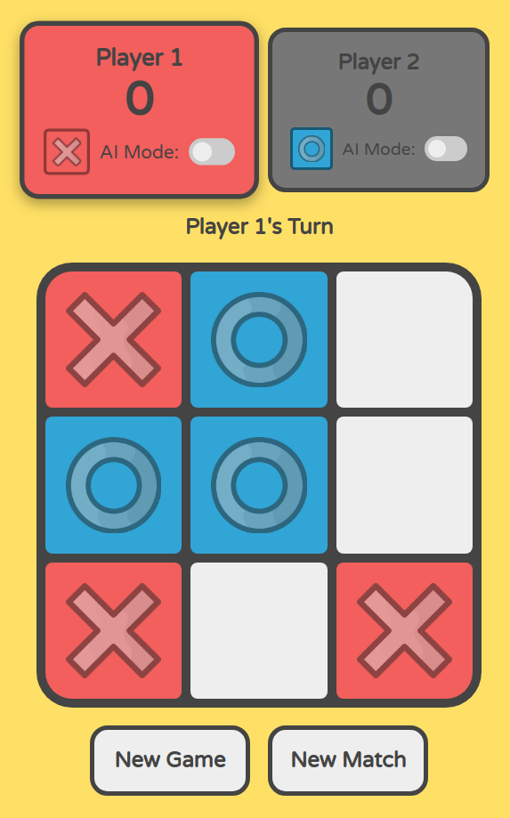

# Tic-Tac-Toe

<!-- PROJECT LOGO -->
 

  

<h3 align="center">Tic-Tac-Toe</h3>

  

    Tic Tac Toe with a Monte Carlo simulated AI.
     
    <a href="https://djsereno.github.io/Tic-Tac-Toe/">Preview</a>
    ·
    <a href="https://github.com/djsereno/Tic-Tac-Toe/issues">Report Bug</a>
    ·
    <a href="https://github.com/djsereno/Tic-Tac-Toe/issues">Request Feature</a>
  

## Built With

- Javascript
- HTML/CSS

## Monte Carlo Simulation

The AI is implemented using a Monte Carlo based simulation. The steps to determine the next best move are as follows:

1. Clone the existing game board in its current state. All simulations will take place on the cloned board.
2. Make the initial move within the simulation at random. Take note of which cell was chosen. Note: The initial move referenced here is the initial move _within the simulation_, not necessarily the first move of the game.
3. Proceed making moves at random while correctly alternating between the current player and the opponent.
4. Simulate the game until there is either a winner or until the game ends in a tie.
5. Rank how good the initial move was based on the outcome of the game. In this implementation, a win awards the initial move +1 point, a tie +0.5 points, and a loss -1 point.
6. Repeat steps 2-5 over and over. More simulations should result in a more accurate "best" initial move.
7. After all simulations are complete, make a move on the real game board based on the highest ranked initial move from the simulation.

These steps are repeated every time it is the AI's turn to make a move.

## Contact

Derek Sereno - [LinkedIn](https://www.linkedin.com/in/dereksereno/) - [Email](mailto:djsereno91@gmail.com)

Project Link: [https://github.com/djsereno/Tic-Tac-Toe/](https://github.com/djsereno/Tic-Tac-Toe/)

## Acknowledgments

- X and O icons by [flatvac](https://www.vecteezy.com/members/flatvac) at [Vecteezy.com](https://www.vecteezy.com/)
- Favicon by [icons8](https://icons8.com/)
